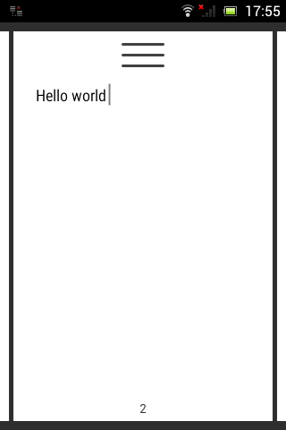

# Notes #

Simple notes implementation for android. It's test task for one firm.

Features:
---
- Minimum android verion is 2.3.7. It will be corrected;
- App requires virtual keyboard (new note will be added if you will type some text and press back button);
- App uses sqlite. Very simple implementation;
- App uses nineoldandroids library.

Created by:
--- 
Anton Golovin.